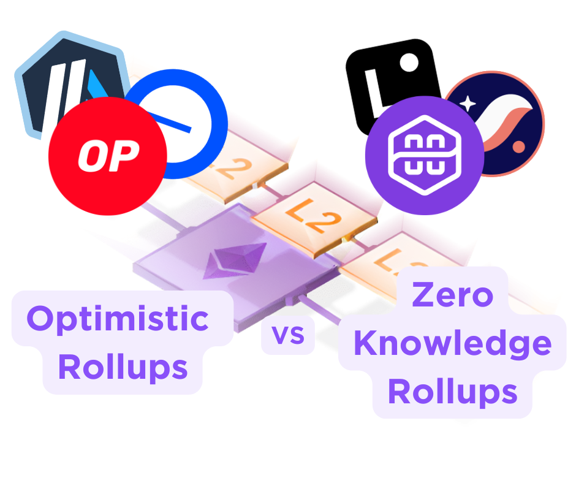
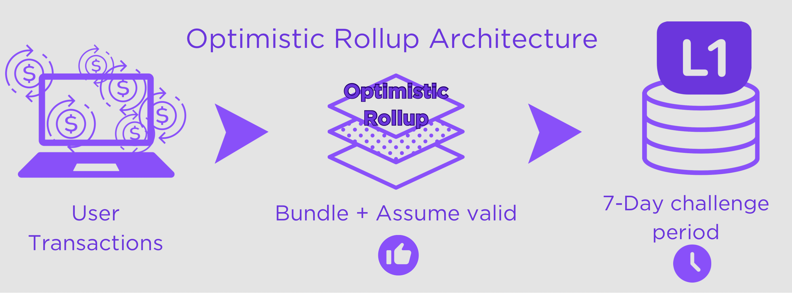
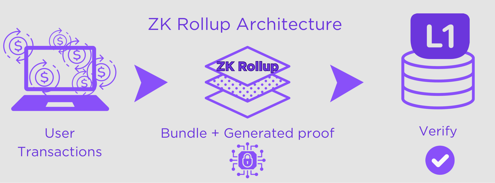

# The Rollup Revolution: Optimistic vs. Zero-Knowledge Scaling Solutions

## How Rollups Are Revolutionizing Blockchain Scalability

Layer 1 networks, like Ethereum, provide decentralization and security, but these benefits come with trade-offs: network congestion and high transaction fees. Ethereum often faces high demand, causing transactions to slow down and fees to spike when traffic increases.

This is where Layer 2 rollups come into play. Imagine a city where everyone drives their own car. When the roads are empty, travel is fast and efficient. But during rush hour, congestion builds up, and people end up stuck in traffic, wasting fuel (gas fees). Rollups are like buses: instead of each person using their own car (individual L1 transactions), rollups bundle many transactions together into a single, more efficient package. This reduces congestion, lowers costs, and keeps the network running smoothly.

There are two kinds of rollups: Optimistic Rollups, which trust transactions are correct unless someone proves otherwise, and ZK-Rollups, which use math to instantly confirm everything is right. Let’s dive deeper into how both of them work, what are the main differences, and which one should be used depending on needs.

## The Optimistic Approach: How Trust-First Rollups Process Transactions

The user interacts with the rollup just like they would interact with any other L1 network (sending tokens, swapping, etc). A sequencer (think of it as a transaction organizer or transaction processor) collects, organizes, and processes these transactions off-chain. Rather than sending every transaction one by one, the rollup bundles them together and submits a summary of all changes to L1.

Since transactions are assumed to be valid by default on optimistic rollups, there is a 7-day challenge period where anyone can check for fraud. If someone finds an issue, they can submit proof to L1, which will then re-run the transaction to check if it was processed correctly. If fraud is detected, the rollup reverses the invalid changes, and the dishonest party is penalized.  
If no one challenges the batch within 7 days, it gets finalized on L1, and users can withdraw their funds.

You might wonder who actually checks to see if these transactions are valid. In theory, anyone can check for fraud in an Optimistic Rollup, but in reality, specific participants take on this role because they have incentives to do so. The system isn’t just relying on random users checking transactions for free. Validators, automated watchers, dApp teams, and bridge operators monitor rollups to detect and challenge fraud, ensuring the network's integrity.

### Case Study: Tracking Withdrawals on Arbitrum

Let’s take Arbitrum One as an example, which is an Optimistic Rollup that uses Ethereum as L1. We can use Arbiscan to check L2 to L1 transactions, which show the status of withdrawals from Arbitrum to Ethereum.

We can see that newer withdrawals (less than 7 days old) are marked as *Waiting*  because they are still in the fraud-proof challenge period. This means the system is assuming the transactions are valid, but if someone detects fraud, they can submit a fraud proof before finalization.

For older withdrawals (7+ days old), an L1 transaction hash is present, meaning they have been finalized on Ethereum and are no longer contestable. These transactions have been fully processed, allowing users to access their funds on L1.

We can explore all batches in the *View Batches* section. When we click on a batch, we can see how many L2 transactions are included. In this case, the batch contains 3506 transactions. 

By clicking on the L1 transaction hash, we can check the gas fee paid to submit this batch to Ethereum. Here, the total cost for finalizing all 3,506 transactions on Ethereum was ~$0.78.  
This means that, on average, each transaction in the batch only costs about $0.00022, which is much cheaper than executing transactions directly on Ethereum.

## The Zero-Knowledge Advantage: Mathematical Proofs for Instant Finality

ZK-Rollups function similarly to Optimistic Rollups in that transactions are processed off-chain and bundled together before being submitted to L1. However, instead of assuming transactions are valid by default and waiting for potential fraud challenges, ZK-Rollups use zero-knowledge proofs (ZK-proofs) to verify correctness upfront. 

These proofs are like showing a correct answer to a math problem without revealing your calculations. Instead of checking every step, the L1 only verifies the final proof, confirming that all transactions were processed correctly in one go. Because complex math is used to compress a bunch of transactions into a single verifiable proof, generating the proof requires intensive computation, which is usually done on high performance hardware (more powerful than your usual PC).

Once the rollup processes a batch of transactions, it submits a proof to L1  along with a summary of transaction data, confirming that everything was executed correctly. Since the L1 can verify the proof instantly, there’s no need for a waiting period, and transactions are finalized immediately.

### Case Study: Tracking Withdrawals on Polygon zkEVM

Let’s take Polygon zkEVM as an example, which is a ZK rollup that uses Ethereum as L1.   
We can use Polygon's zkEVM block explorer to check L2 to L1 transactions, which show the status of withdrawals from the rollup to Ethereum.

Transactions first appear as *Pending Claim* while waiting for Ethereum to verify the rollup's proof. Once verified, they receive an *L1 Verified Batch Tx Hash*, confirming finalization.We can see that zkEVM withdrawals don’t require a 7-day challenge period and can be claimed immediately after verification.

All batches, starting with the latest, can be seen by selecting *View Batches*. The first thing we see is the status: *Finalized* means the batch is now fully settled on Ethereum, with no possibility of being reversed or disputed, while *L2 Sequence Committed* means that the batch of transactions has been received and ordered by the rollup's sequencer but has not yet been verified or finalized on Ethereum.

Let’s take a random batch of 63 transactions. The total gas cost for finalizing a batch is the sum of the gas fees for two transactions, Sequence Tx and Verify Batch Tx. For this batch, the gas fee for the first is $0.59, while for the latter it is $2.99, making the final price per transaction $0.05.

ZK Rollups typically have smaller batch sizes primarily because of the computational demands of generating zero-knowledge proofs. This difference is actually changing over time though. Some newer implementations are starting to handle batch sizes closer to what Optimistic Rollups can process.

## Fundamental Differences: How Optimistic and ZK Rollups Diverge

While both Optimistic and ZK-Rollups scale L1 networks by bundling transactions, they handle verification quite differently.

Optimistic Rollups assume transactions are valid but give everyone a 7-day window to challenge anything suspicious. This makes them simpler to build, but means they are less secure, and you'll wait a week to withdraw funds to L1. 

ZK-Rollups use mathematical proofs to verify transactions instantly, allowing immediate withdrawals. They're more complex and expensive to set up initially, due to computational costs and need for powerful hardware, but offer better security. Interestingly, ZK-Rollups can start without their fancy prover (the part that handles the proofs) just like Optimistic Rollups, and add it later when needed.

When it comes to costs, Optimistic Rollups are cheaper to launch but can get more expensive long-term because they must publish more data back to L1 for potential fraud challenges. ZK-Rollups achieve better data efficiency by compressing the information sent to L1. Since every byte of data published to L1 costs gas fees, this compression significantly reduces costs, making them more cost-effective at scale, especially for applications processing a lot of transactions.

| Feature | Optimistic Rollups | ZK Rollups |
|---|---|---|
| **Verification Method** | Assume valid, challenge if fraud detected | Cryptographically prove validity |
| **Withdrawal Time** | 7-day waiting period | Near immediate |
| **Setup Complexity** | Simpler and cheaper | Can start without prover (simple setup) or with full prover (complex) |
| **Flexibility** | Standard approach | Can start simple and add prover later for enhanced security |
| **Price** | Lower upfront cost, higher data costs long-term | Higher upfront cost, more efficient at scale |
| **Best For** | Games, NFTs, general apps | Financial apps, enterprise solutions |
| **Examples** | Arbitrum, Optimism | zkSync, Polygon zkEVM, StarkNet |

## Final Thoughts

Rollups are changing the game for L1 networks, making transactions faster and cheaper. Optimistic Rollups keep things simple but require a waiting period, while ZK-Rollups use advanced cryptography for instant finality, but require a lot of computation power. As rollup technology evolves, projects like [Gateway.fm](http://Gateway.fm) are making it easier for developers to build on top of these scaling solutions.
